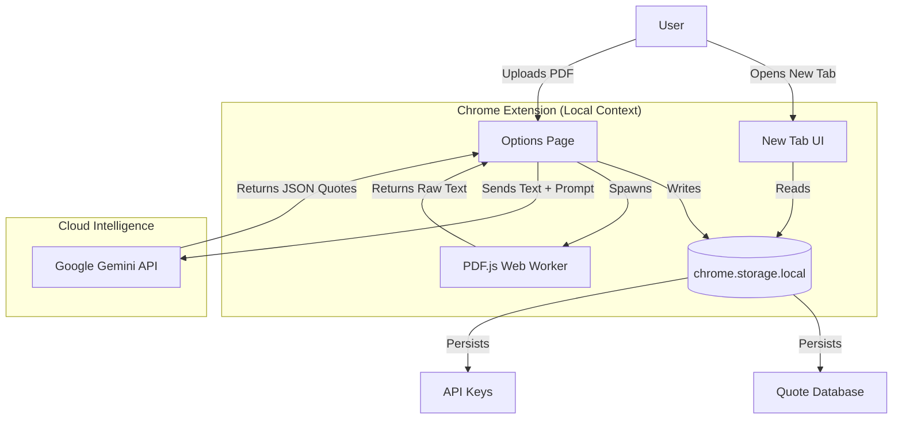

# High Level Design: Self-Help Wisdom Extension

## 1. Executive Summary
**Self-Help Wisdom** is a Chrome Extension that transforms the browser's "New Tab" page into a personalized source of motivation. Unlike generic quote extensions that rely on static, pre-packaged databases, this system uses **Google Gemini AI** to dynamically read, understand, and extract meaningful insights from the user's *own* PDF library. 

It is designed with a **"Privacy First, Pulse Fast"** philosophy: all data processing (parsing) happens locally or via ephemeral API calls, and the UI is built with Vanilla JavaScript to ensure zero-latency rendering.

---

## 2. System Architecture

The system follows a **Serverless, Client-Heavy** architecture. There is no traditional backend server; the "backend" logic is split between the browser's local execution environment (Service Workers) and Google's Generative AI Cloud.

### Architecture Diagram



---

## 3. Core Components

### A. The "Face" (Presentation Layer)
*   **File**: `newtab.html` / `script.js`
*   **Responsibility**: Delivers the core value proposition—displaying wisdom.
*   **Key Features**:
    *   **Zero-Latency Rendering**: Uses Vanilla JS to paint the quote immediately, avoiding framework startup costs.
    *   **Breathing Widget**: A micro-interactive tool for mindfulness.
    *   **Habit Tracker Bridge**: A password-protected gateway to extensive tracking sheets (Privacy feature).
    *   **Smart Redirect**: Automatically redirects idle users to Google to prevent distraction loops.

### B. The "Brain" (Intelligence Layer)
*   **File**: `services/ai_service.js`
*   **Responsibility**: Interfacing with the LLM.
*   **Key Innovation**: **Dynamic Model Discovery**.
    *   Instead of hardcoding `gemini-1.5-flash`, the service queries the `/models` endpoint to find the best *currently available* model. This prevents "model rot" where an extension breaks because a specific model version was deprecated.

### C. The "Ingestor" (Processing Layer)
*   **File**: `options.js` / `lib/pdf.worker.min.js`
*   **Responsibility**: Transforming raw binary files into structured data.
*   **Flow**:
    1.  **PDF.js** is used to parse the PDF structure.
    2.  A **Web Worker** is employed to keep the UI responsive while parsing large (500+ page) books.
    3.  Text is cleaned and sent to the AI Service.

### D. The "Memory" (Persistence Layer)
*   **Mechanism**: `chrome.storage.local`
*   **Responsibility**: Stores the user's API Key and the generated Library of Quotes.
*   **Rationale**: 
    *   **Privacy**: Data never leaves the user's machine (except the ephemeral trip to the API for processing).
    *   **Speed**: Faster read access than `chrome.storage.sync`, allowing for instant new-tab painting.

---

## 4. Key Data Flows

### Workflow 1: The "Wisdom Extraction" Pipeline
This is the most complex flow in the system, converting a raw file into actionable wisdom.

1.  **Input**: User selects a PDF in `options.html`.
2.  **Valdiation**: System checks MIME type (`application/pdf`).
3.  **Extraction (Local)**: 
    *   `pdf.js` reads the binary.
    *   Text content is extracted page-by-page and concatenated.
4.  **Semantic Processing (Cloud)**:
    *   The text is sent to Gemini with a system prompt: *"You are an expert literary curator... Extract 1-5 profound quotes as JSON."*
5.  **Sanitization**: The resulting string is parsed, stripped of Markdown fencing (e.g., ` ```json `), and validated as an Array.
6.  **Persistence**: The new quotes are appended to the `customQuotes` array in local storage.

### Workflow 2: The "Morning Routine" Loop
1.  **Trigger**: User opens a new tab.
2.  **Fetch**: `script.js` requests the `customQuotes` key from storage.
3.  **Selection**: A random index is generated. Logic ensures the same quote isn't shown twice in a row.
4.  **Render**: Text is injected into the DOM.
5.  **Timeout**: A timer starts. If the user doesn't interact (search/widgets), they are redirected, enforcing a "focus" mode.

---

## 5. Technology Stack & Rationale

| Component | Choice | Rationale |
| :--- | :--- | :--- |
| **Framework** | **Vanilla JS** | **Performance**. React/Vue adds ~30-50kb overhead and hydration time. For a New Tab page, every millisecond of load time feels like a "glitch". |
| **Platform** | **Manifest V3** | **Security**. Complies with modern Chrome Web Store requirements (no remote code execution, Service Worker based background tasks). |
| **Parsing** | **PDF.js** | **Privacy**. Allows us to parse books *inside* the browser. We don't need to upload the user's private book to a server to read it. |
| **AI** | **Gemini API** | **Context Window**. Gemini's large context window (Flash 1.5) is ideal for consuming large chunks of book text in a single pass. |

---

## 6. Future Scalability
*   **Vector Search**: Currently, quotes are random. Future state could embed quotes into vectors (using `chrome.ai` or external API) to allow users to search "Give me wisdom about *failure*" and retrieve semantically relevant quotes.
*   **Sync**: Migrating specific curated lists to `chrome.storage.sync` to share quotes across devices.
